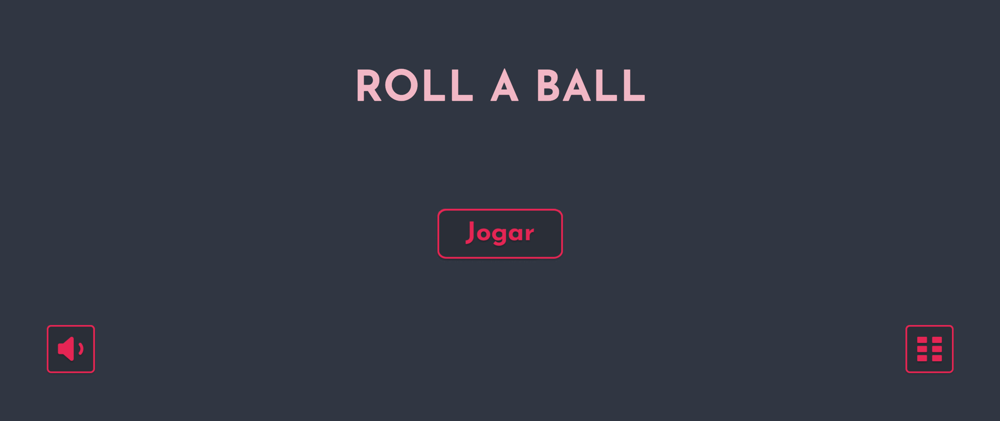
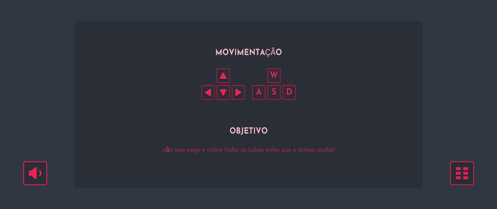
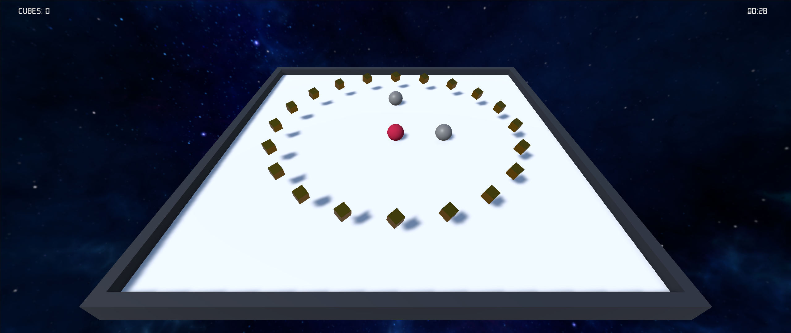
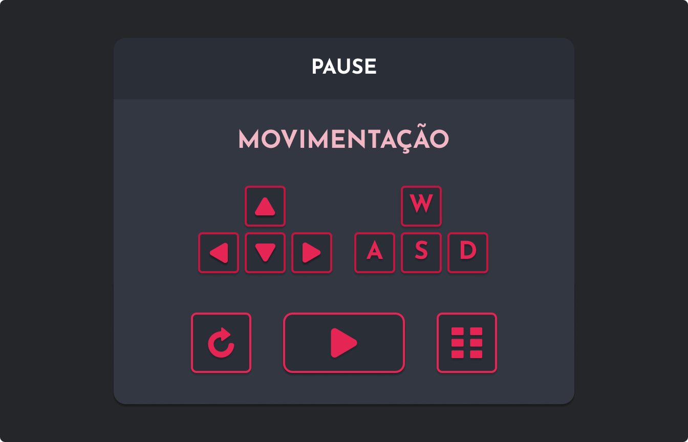

# Projeto Roll-a-Ball

Este é um projeto de jogo digital desenvolvido como parte do curso de Jogos Digitais do sétimo semestre da Engenharia de Computação.

## Descrição do Jogo

O Roll-a-Ball é um jogo simples onde o jogador controla uma bola e deve coletar objetos espalhados pelo cenário, evitando obstáculos. O objetivo é acumular pontos ao coletar os objetos o mais rápido possível.

## Status do Projeto (Rubrica)

Este projeto cumpre a rubrica apresentada a seguir:
- [x] **Entrega do Tutorial:** Tutorial completo e funcionalidades básicas implementadas.
- [x] **Mecânica de Tempo:** Adicionada mecânica de decremento de tempo para tornar o jogo mais desafiador.
- [x] **Inimigos:** Inimigos introduzidos como obstáculos fatais para o jogador.
- [x] **Visual Aprimorado:** Tema visual aprimorado com uso de texturas e skybox temático.
- [x] **Música:** Trilha sonora adicionada ao jogo no menu e no game principal.
- [x] **Efeitos Sonoros:** Efeitos sonoros implementados para interações no jogo com a captura dos cubos e derrota/vitória.
- [x] **Menu Inicial:** Menu inicial implementado junto com um tutorial dos comandos.
- [x] **Tratamento de Dead-End:** Tratamento para situações sem saída como player cair fora da arena do game.
- [x] **Página Itch.io:** Página do Itch.io bem construída, com todas as informações necessárias e vídeo demonstrativo.
- [x] **Entrega no Prazo:** Projeto entregue dentro do prazo.
- [x] **Repositório Público:** Código fonte disponível em repositório público.
- [x] **WebGL:** Jogo disponível em WebGL, jogável pelo navegador.
- [x] **Integridade Acadêmica:** Respeito total à integridade acadêmica, com todos os créditos devidamente atribuídos.

## Funcionalidades

- Controle da bola usando teclado ou controles de toque (em dispositivos móveis).
- Coleta de objetos para acumular pontos.
- Obstáculos que devem ser evitados para não perder pontos.
- Interface de usuário simples e intuitiva.

## Visual do Jogo

Aqui estão algumas telas do jogo:

## Testando as Funcionalidades

Assista ao vídeo abaixo para ver as funcionalidades do jogo em ação:

## Teste o Jogo

Você pode testar o jogo diretamente no itch.io. Clique no link abaixo:

[Roll a Ball: My First Game](https://marcosvds.itch.io/roll-a-ball)

## Recursos Utilizados no Jogo

### Fonte

Utilizamos a fonte *Josefin Sans* em nosso jogo. Você pode encontrá-la e baixá-la através do seguinte link: [Josefin Sans - Google Fonts](https://fonts.google.com/specimen/Josefin+Sans).

### Assets de Interface do Usuário (GUI)

Utilizamos os assets de GUI do pacote *Silent* para diversos elementos da interface do nosso jogo. Este pacote oferece um estilo minimalista, limpo, escuro e flat, sendo perfeito para o visual que queríamos alcançar.

### Conteúdo do Pacote

- Ícones
- Botões
- Tela inicial
- Tela de níveis
- Popups
- Barra de progresso
- Estrelas

Formatos de arquivo disponíveis: SVG, PNG.

Estes assets podem ser utilizados para fins pessoais ou comerciais, mas não podem ser revendidos.

Para mais detalhes, visite [Silent no itch.io](https://prinbles.itch.io/silent).

## Assets gratuitos Skyboxes da Coleção Sky Series

Para enriquecer o ambiente visual do nosso jogo e adicionar mais imersão, utilizamos um Skybox gratuito da coleção Sky Series, disponíveis na Unity Asset Store. Estes skyboxes oferecem uma variedade de cenários celestiais, desde a luz do dia até configurações cósmicas, melhorando significativamente a atmosfera do jogo.

[Veja este asset na Unity Asset Store](https://assetstore.unity.com/packages/2d/textures-materials/sky/skybox-series-free-103633)

## Como Contribuir

Se você deseja contribuir para o desenvolvimento deste projeto, siga estas etapas:

1. Fork este repositório.
2. Crie um branch com a sua feature (`git checkout -b feature/sua-feature`).
3. Faça commit de suas mudanças (`git commit -am 'Adiciona nova feature'`).
4. Faça push para o branch (`git push origin feature/sua-feature`).
5. Crie um novo Pull Request.

